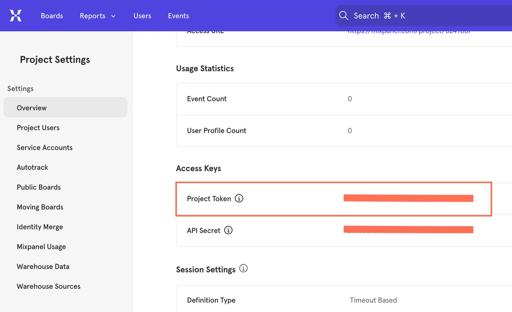

# Wix CLI App Template: Mixpanel Analytics

The Mixpanel Analytics Wix app template is part of the [Wix app templates collection](https://dev.wix.com/apps-templates).

This Wix CLI template demonstrates the use of the embedded script extension to integrate Mixpanel analytics code into Wix sites. It is an excellent example for developers looking to build applications using embedded scripts. It also demonstrates the basic functionality of the React SDK, the Dashboard React SDK, and the Wix Design System.

The template creates an embedded script containing Mixpanel's code snippet, and a dashboard page where the site owner can enter their Mixpanel project token to inject the embedded script code.

## About Wix app templates

[Wix apps](https://dev.wix.com/docs/build-apps) enhance the functionality of Wix sites by adding new features such as custom pages, dashboard components, third-party integrations, or site analytics. Starting with an app template fast-tracks the development process, providing a working foundational app that developers can modify and build upon. This approach saves valuable time, allowing for a quick transition from concept to a fully functional app.

Learn more about [Wix app templates](https://dev.wix.com/docs/build-apps/get-started/templates/get-started-from-an-app-template) and explore our growing [template collection](https://dev.wix.com/apps-templates).

## Template features

This Wix app template incorporates the following features:

+ **Wix CLI:** Get a comprehensive developer experience with minimal setup and host your app on Wix with 1 command. Learn more about the [Wix CLI for apps](https://dev.wix.com/docs/build-apps/developer-tools/cli/get-started/about-the-wix-cli-for-apps).
+ **Wix Design System:** Utilize Wix's reusable React components for a cohesive user experience consistent with Wix's design standards.
+ **Wix React SDK:** Simplify API requests to the Wix ecosystem.
+ **Wix Dashboard React SDK:** Integrate custom dashboard components with the Wix site dashboard.
+ **Embedded script extension:** Embed an HTML code fragment on users' sites. For more information, see [Embedded Scripts](https://dev.wix.com/docs/build-apps/developer-tools/cli/wix-cli-for-apps/extensions/embedded-scripts).

## Prerequisites

Before getting started, make sure you have the following set up:

+ [Node.js](https://nodejs.org/en/) (v18.16.0 or higher)
+ [A Wix developer account](https://users.wix.com/signin?loginDialogContext=signup&referralInfo=HEADER&postLogin=https:%2F%2Fdev.wix.com%2Fdc3%2Fmy-apps&postSignUp=https:%2F%2Fdev.wix.com%2Fdc3%2Fmy-apps&forceRender=true)
+ [A Mixpanel account](https://mixpanel.com/).

## Local Development

We first need to create local files for our app project and set up a local development environment for preview and testing.

## Step 1 | Create a new app project with the Mixpanel Analytics template

Run the following command to create a new app project using this template:

```bash
npm create @wix/app@latest -- --template c442b755-2276-4336-918a-915865a9fa2b
```

When asked what you would like to create, choose **A new Wix App**.

In the creation process, you will be asked for a Wix app name and a package name for your project.

+ The Wix app name is the name that appears for your app in the [Wix Dev Center](https://dev.wix.com/apps/my-apps).
+ The package name is  the name of the package created locally for your project, and the name of the directory containing your project’s local files.

### What you get

This process registers a new app in the Wix Dev Center with the required permissions pre-configured, and it generates a new app project in your local file system. The project contains all the files your app needs to run locally and in production.

The project includes:

+ Initial boilerplate code for a simple app with:
  + An embedded script extension containing a Mixpanel script.
  + A [dashboard page](https://dev.wix.com/docs/build-apps/developer-tools/cli/wix-cli-for-apps/extensions/dashboard-pages) where a site admin can enter a Mixpanel project token. When a token is provided, the Mixpanel script is embedded on the site.
+ A `package.json` file with your app's dependencies.

## Step 2 | Test the app

The app creation process installs the app on your chosen development site. However, there is still some configuration required before your app will function.

### Set up a local development environment

You won’t see the app extensions on your development site until you build the app and create a version. To test the app during development, set up a local development environment using the following command.

```bash
npm run dev
```

This will prompt you with the following CLI menu:

```bash
View your local changes: (Press a key to open)
  ›  S  - Site (publish the site to enable site preview)
  ›  D  - Dashboard  - /
```

Type `D` to open a browser window with a preview of the app's dashboard page.

The development environment is set up for hot reloading, so any changes you make to your code will be reflected in the browser.

### Enter your Mixpanel Project Token

To complete this app's setup, you must provide a Mixpanel project token.

1. Go to your chosen [Mixpanel](https://mixpanel.com/) project, or create a new one.
1. Navigate to **Project Settings > Overview** and find your **Project Token** under **Access Keys**. Save the token.

    

1. Return to the app’s page in your development site dashboard. In the text field under **Setup**, enter the token you saved and click **Activate**. This will both add the token to your embedded script parameters, and inject the code for the embedded script into the DOM of your site.

## Extend and customize the app

The template is designed for easy customization and extension. Here are some suggested entry points where you can add your own custom logic or functionality:

### Dashboard page customization

The dashboard page is pre-integrated with the [Wix Design System](https://www.wixdesignsystem.com/) and [Wix Dashboard SDK](https://dev.wix.com/docs/sdk/host-modules/dashboard/introduction), providing a simple user interface that includes support for server-side rendering.

Customize the dashboard page to fit your specific needs, whether it's updating the UI or adding new features.

**Development entry point:** [`template/src/dashboard/pages/page.tsx`](./template/scr/dashboard/pages/page.tsx)

This file contains the parent component for the dashboard interface. It contains the `ProjectToken` component described below.

### `ProjectToken` component customization

The ProjectToken component uses the [Wix Design System](https://www.wixdesignsystem.com/) and [Wix Dashboard SDK](https://dev.wix.com/docs/sdk/api-reference/dashboard/introduction), providing a simple user interface that includes support for server-side rendering.

It defines a component that appears on your dashboard page with text, a button, and a text input box.

When a project token is provided, this component calls the [embedScript()](https://dev.wix.com/docs/sdk/backend-modules/app-market/embedded-scripts/embed-script) method from the Wix SDK to inject the script into the DOM of the site. The provided project token is passed as a parameter in the Embed Script API call.

Customize this component to change the appearance or functionality of the component.

**Development entry point:** [`template/src/dashboard/components/ProjectToken.tsx`](./template/src/dashboard/components/ProjectToken.tsx)

This file contains the `ProjectToken` component. It uses the hook functions defined in [`template/src/dashboard/hooks/wix-embeds.ts`](./template/src/dashboard/hooks/wix-embeds.ts) to embed the HTML fragment in the embedded script on the site.

## Deployment

After the app is created you can build it, which allows you to:

+ Create a preview to share with others.
+ Create new versions of your app in the Dev Center.

### Build the app

To build the app, run one of the following:

```bash
npm run build
```

### Preview the app

You can create an online preview of your built app using the following command:

```bash
npm run preview
```

This command provides an inline link to an app preview URL.

You can share this URL with collaborators on your development site. It directs to a dashboard page where they can preview and test your app.

### Create an app version

An app version allows you to publish an app to the [Wix App Market](https://www.wix.com/app-market) or install it on a site with a direct install URL.

To create an app version, run the following command:

```bash
npm run create-version
```

This guides you through creating a new app version in the Wix Dev Center. Once the app version is created, you can optionally [submit it for review](https://devforum.wix.com/kb/en/article/submit-your-app-for-review) and publish it to the [Wix App Market](https://www.wix.com/app-market).

To learn more about app versions, see [App Versions and Deployment](../workflow/app_versions_and_deployment.md).

## Learn more

For more information:

+ Learn more about [Wix app templates](https://dev.wix.com/docs/build-apps/get-started/templates/get-started-from-an-app-template).
+ Check out our [full collection of app templates](https://dev.wix.com/apps-templates).
+ See our documentation for details about [building Wix apps](https://dev.wix.com/docs/build-apps).
