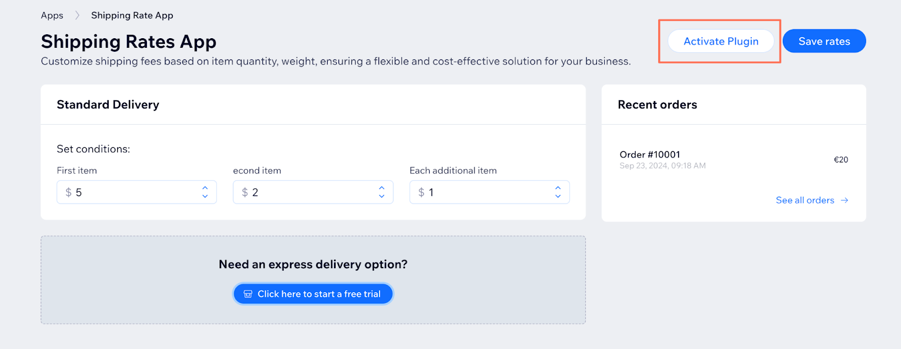
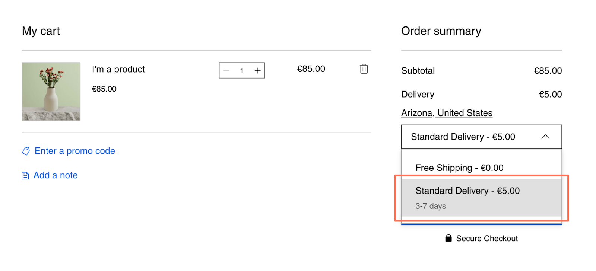

# Wix CLI App Template: Shipping Rates

The Shipping Rates Wix app template is part of the [Wix app template collection](https://dev.wix.com/apps-templates?filter=cli).

This Wix CLI template demonstrates the use of the Wix Ecom Orders API, App Management API, and [Wix eCommerce Shipping Rates service plugin](https://dev.wix.com/docs/sdk/backend-modules/ecom/service-plugins/shipping-rates/introduction). The app template includes functionality for creating and managing custom shipping methods and costs, and offering a free trial of premium features to users. It is an excellent starting point if you plan on creating an app with a [backend API](https://dev.wix.com/docs/build-apps/develop-your-app/frameworks/wix-cli/supported-extensions/backend-extensions/api/add-api-extensions-with-the-cli) to fetch data, [service plugin](https://dev.wix.com/docs/build-apps/develop-your-app/frameworks/wix-cli/supported-extensions/backend-extensions/service-plugins/add-service-plugin-extensions-with-the-cli) integration (particularly shipping rates,) or a free trial offer for users.

The template also demonstrates the basic functionality of the Dashboard SDK, and Wix Design System. 

> **Note:** This app is intended for Wix sites with the Wix Stores app installed. For it to function correctly, the site owner must [install Wix Stores](https://www.wix.com/app-market/wix-stores) from the app market.

## About Wix app templates

[Wix apps](https://dev.wix.com/docs/build-apps) enhance the functionality of Wix sites by adding new features such as custom pages, dashboard components, third-party integrations, or site analytics. Starting with an app template fast-tracks the development process, providing a working foundational app that developers can modify and build upon. This approach saves valuable time, allowing for a quick transition from concept to a fully functional app.

Learn more about [Wix app templates](https://dev.wix.com/docs/build-apps/get-started/templates/get-started-from-an-app-template) and explore our growing [template collection](https://dev.wix.com/apps-templates?filter=cli).

## Template features

This Wix app template incorporates the following features:

- **Wix CLI:** Get a comprehensive developer experience with minimal setup and host your app on Wix with one command. Learn more about the [Wix CLI for apps](https://dev.wix.com/docs/build-apps/developer-tools/cli/get-started/about-the-wix-cli-for-apps).
- **Wix Design System:** Utilize Wix's reusable React components for a cohesive user experience consistent with Wix's design standards.
- **Wix eCommerce Orders API**: Access and manage Wix eCommerce Orders data on a Wix site (this data is for orders made through the Wix Stores app). Learn more about the [Wix eCommerce API](https://dev.wix.com/docs/sdk/backend-modules/ecom/introduction).
- **Backend API**: Define your own HTTP functions that can be called from your frontend code. Read more about [Backend APIs](https://dev.wix.com/docs/build-apps/develop-your-app/frameworks/wix-cli/supported-extensions/backend-extensions/api/add-api-extensions-with-the-cli).
- **Shipping Rates service plugin:** Integrate custom logic for calculating shipping rates. Learn more about the [Shipping Rates service plugin](https://dev.wix.com/docs/sdk/backend-modules/ecom/service-plugins/shipping-rates/introduction).
- **Free trial functionality**: Integrate with a free trial in the Wix App Market to offer users a free trial with additional features. Read more about [free trials](https://dev.wix.com/docs/build-apps/launch-your-app/pricing-and-billing/set-up-and-manage-free-trials).

## Prerequisites

Before getting started, make sure you have the following set up:

- [Node.js](https://nodejs.org/en/) (v18.16.0 or higher)
- [A Wix developer account](https://users.wix.com/signin?loginDialogContext=signup&referralInfo=HEADER&postLogin=https:%2F%2Fdev.wix.com%2Fdc3%2Fmy-apps&postSignUp=https:%2F%2Fdev.wix.com%2Fdc3%2Fmy-apps&forceRender=true)

## Local Development

We first need to create local files for our app project and set up a local development environment for preview and testing.

## Step 1 | Create a new app project with the Shipping Rates template

In the directory where you want to create your project, run the following command:

```bash
# npm
npm create @wix/app@latest -- --template a033018e-233a-4ddc-8471-1151d8974866

# yarn
yarn create @wix/app --template a033018e-233a-4ddc-8471-1151d8974866
```

In the creation process, you will be asked for:

- A **Wix app name**. This is the name of your app in the [App Dashboard](https://dev.wix.com/app-selector?title=Select+an+App&primaryButtonText=Select+Site&actionUrl=https%3A%2F%2Fdev.wix.com%2Fapps%2F%7BappId%7D%2Fhome).
- A **package name**. This is the name of the package created locally for your project, and the name of the directory containing your project’s local files.

### What you get

This process registers a new app in the App Dashboard with the required permissions pre-configured, and it generates a new app project in your local file system. The project contains all the files your app needs to run locally and in production.

The project includes:

- Initial boilerplate code for a simple app with:
    - A shipping rates service plugin extension that defines custom shipping rates that are displayed on cart and checkout pages of sites the app is installed on.
    - A custom [backend API](#backend-api) to get and update app data stored in a collection or database.
    - [Free trial functionality](#free-trial) with additional features for users that sign up.
    - A modal instructing users how to activate the shipping rates service plugin.
- A `package.json` file with your app’s dependencies.

#### Backend API

A [backend API extension](https://dev.wix.com/docs/build-apps/develop-your-app/frameworks/wix-cli/supported-extensions/backend-extensions/api/add-api-extensions-with-the-cli) is defined in [`template/src/backend/api/shipping-data/api.ts`](./template/src/backend/api/shipping-data/api.ts). The purpose of this API is to abstract underlying functionalities, streamlining data management while simplifying future modifications. 

The API allows app instances to call the backend to get and update app data stored in a collection or database.`GET` and `POST` requests to this API call `getAppData()` and `updateAppData()` respectively, which are defined in in [`template/src/backend/database.ts`](./template/src/backend/database.ts). In this template we’re using a mock database where `getAppData()` returns hardcoded values, and `updateAppData()` logs the update data. The actual implementation of storing and updating data in a database or collection is left to you.

We call the API using `getShippingAppData()` and `setShippingAppData()` in the [dashboard page code](./template/src/dashboard/pages/page.tsx). These functions are defined in [`template/src/dashboard/hooks/use-shipping-app-data.ts`](./template/src/dashboard/hooks/use-shipping-app-data.ts).

#### Free trial

This template adds free trial functionality and additional features to users that sign up. This is implemented through:

- Integration with a free trial in the Wix App Market using [`getAppInstance()`](https://dev.wix.com/docs/sdk/backend-modules/app-management/app-instances/get-app-instance) to detect if the user is currently on a free trial. 
- An upgrade card defined in [`template/src/dashboard/components/UpgradeCard.tsx`](./template/src/dashboard/components/UpgradeCard.tsx) prompting the user to start the free trial and linking them to a sign up page. This card is displayed in the dashboard page only if the user hasn't started a free trial.
- A free trial message component defined in [`template/src/dashboard/components/FreeTrialMessage.tsx`](./template/src/dashboard/components/FreeTrialMessage.tsx) informing the user of the expiry date of their free trial and providing a link to a page where they can manage their subscriptions. This message is displayed in the dashboard page only if the user has started a free trial.
- An express delivery shipping option. If the user has started the free trial:
    - Express delivery settings are displayed and can be configured on the dashboard page.
    - The shipping rates service plugin's response includes the information for express delivery.

## Step 2 | Test the app

The app creation process installs the app on your chosen development site. However, there is still some configuration required before your app will function.

### Install the Wix Stores App

This app makes calls to the Wix eCommerce [Orders API](https://dev.wix.com/docs/sdk/backend-modules/ecom/orders/setup) to retrieve the latest orders made in the site’s store. Before you test this app on your development site, install the [Wix Stores app](https://www.wix.com/app-market/wix-stores) to [add the Wix eCommerce platform’s functionality](https://dev.wix.com/docs/rest/business-solutions/e-commerce/wix-e-commerce-platform-handbook/get-started/installation) to your site.

### Set up a free trial for your app.
Follow the instructions to [Set up a Wix-managed free trial](https://dev.wix.com/docs/build-apps/launch-your-app/pricing-and-billing/set-up-and-manage-free-trials#set-up-a-wix-managed-free-trial) for your app.

### Set up a local development environment

The app creation process installs the app on your chosen development site. However, you won’t see the app extensions on your site until you build the app and create a version. To test the app during development, set up a local development environment using the following command:

```bash
npm run dev
```

This will prompt you with a CLI menu. Follow the instructions to open a browser window with a preview of the app's dashboard page.

The development environment is set up for hot reloading, so any changes you make to your code will be reflected in the browser.

>**Note:** You won't be able to test service plugin extensions in your local development environment before building your app and creating a version. (See the testing steps below.)

### Testing steps

Before testing your app, you must [build and create a version](https://dev.wix.com/docs/build-apps/develop-your-app/frameworks/wix-cli/app-development/build-and-deploy-an-app-with-the-cli).

> **Note:** After creating a version, you can use the [`logs`](https://dev.wix.com/docs/build-apps/develop-your-app/frameworks/wix-cli/app-development/cli-command-reference#logs) command to view logs from the backend API and the service plugins.
>
>```bash
> npm run logs –version <version number> 
>```

1. Run `npm run dev` to open the CLI menu.
1. Press **D** to open the app’s dashboard page in your browser. 
1. Click **Activate Plugin** and follow the plugin activation steps shown in the modal.
   
   


1. Back in the terminal, press **S** to open your development site in your browser.
1. Add at least 1 item to your cart and navigate to your Cart page.
1. Open the shipping rates dropdown in the order summary. You should see a new **Standard Delivery** method with the settings defined in your app’s shipping rates service plugin.
   
   

## Extend and customize the app

The template is designed for easy customization and extension. Here are some suggested entry points where you can add your own custom logic or functionality:

### Dashboard page customization

The dashboard page is pre-integrated with the Wix Design System and Wix Dashboard SDK, providing a simple user interface that includes support for server-side rendering.

It utilizes the app's own APIs to query, present, and allow updates to the shipping rates settings.

Customize the dashboard page to fit your specific needs, whether it's updating the UI or adding new features.

Development entry point: [`template/src/dashboard/pages/page.tsx`](./template/src/dashboard/pages/page.tsx)

### Dashboard page component customization

You can customize any of the components used on the dashboard page as you would customize the dashboard page itself.

Development entry point: [`template/src/dashboard/components`](./template/src/dashboard/components)


### Backend API customization

The Backend API abstracts underlying functionalities, streamlining data management while simplifying future modifications. It allows app instances to call the backend to get and update app data.

In this template we’re using a mock database where `getAppData()` returns hardcoded values, and `updateAppData()` logs the update data. Add your own logic to connect to a database or collection, and store and retrieve the user's data.  You can associate data in your database with the specific instance of the app that created it using [app instance IDs](https://dev.wix.com/docs/build-apps/develop-your-app/access/app-instances/about-app-instances#app-instance-id). You can get the app instance ID by calling `getAppInstance()` in [`appInstance.ts`](./template/src/backend/appInstance.ts). 


Development entry point: [`template/src/backend/database.ts`](./template/src/backend/database.ts)

You can also add additional support for additional API calls with new functionality.

Development entry point: [`template/src/backend/api/shipping-data/api.ts`](./template/src/backend/api/shipping-data/api.ts)

### Service Plugin

This template uses the Shipping Rates service plugin to integrate custom logic for calculating shipping rates. 

Customize the logic used to calculate the existing shipping rates, or add entirely new shipping rates.

Development entry point: [`template/src/backend/service-plugins/ecom-shipping-rates/fast-post/plugin.ts`](./template/src/backend/service-plugins/ecom-shipping-rates/fast-post/plugin.ts)

You can also use a different service plugin entirely. This template’s modular design makes it easy to swap out the current shipping rates service plugin with another without having to rework the overall architecture. 

## Learn more

For more information:

- Learn more about [Wix app templates](https://dev.wix.com/docs/build-apps/get-started/templates/get-started-from-an-app-template).
- Check out our [full collection of app templates](https://dev.wix.com/apps-templates?filter=cli).
- See our documentation for details about [building Wix apps](https://dev.wix.com/docs/build-apps).


## Questions / Issues
Reach us in Discord in case you have more questions https://discord.gg/wixstudio