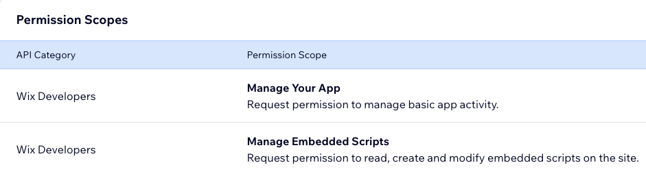

# Wix CLI App Template: Site Popup

The Site Popup Wix app template is part of the [Wix app templates collection](https://dev.wix.com/apps-templates).

This Wix CLI template demonstrates how to add a site popup with an [embedded script](https://dev.wix.com/docs/build-apps/developer-tools/cli/wix-cli-for-apps/extensions/embedded-scripts#before-you-begin). The app creates a dashboard page where site admins can customize the popup’s characteristics, such as the displayed image, text, and when it is active (always or during certain dates). This is an excellent starting point for building apps that use embedded scripts to add customizable features to a site.

The template also demonstrates the basic functionality of the React SDK, the Dashboard React SDK, and the Wix Design System.

## About Wix app templates

[Wix apps](https://dev.wix.com/docs/build-apps) enhance the functionality of Wix sites by adding new features such as custom pages, dashboard components, third-party integrations, or site analytics. Starting with an app template fast-tracks the development process, providing a working foundational app that developers can modify and build upon. This approach saves valuable time, allowing for a quick transition from concept to a fully functional app.

Learn more about [Wix app templates](https://dev.wix.com/docs/build-apps/developer-tools/templates-and-examples/get-started-from-an-app-template) and explore our growing [template collection](https://dev.wix.com/apps-templates).

## Template features

This Wix app template incorporates the following features:

+ **Wix CLI**: Get a comprehensive developer experience with minimal setup and host your app on Wix with 1 command. Learn more about the Wix CLI for  apps.
+ **Wix Design System**: Utilize Wix's reusable React components for a cohesive user experience consistent with Wix's design standards.
+ **Wix React SDK**: Simplify API requests to the Wix ecosystem.
+ **Wix Dashboard React SDK**: Integrate custom dashboard components with the Wix site dashboard.
+ **Wix App Market SDK**: Use the Embedded Scripts API to inject HTML code into a user’s site.

## Prerequisites

Before getting started, make sure you have the following set up:

+ [Node.js](https://nodejs.org/en/) (v18.16.0 or higher)
+ [A Wix developer account](https://users.wix.com/signin?loginDialogContext=signup&referralInfo=HEADER&postLogin=https:%2F%2Fdev.wix.com%2Fdc3%2Fmy-apps&postSignUp=https:%2F%2Fdev.wix.com%2Fdc3%2Fmy-apps&forceRender=true)

## Local Development

We first need to create local files for our app project and set up a local development environment for preview and testing.

## Step 1 | Create a new app project with the Site Popup template

In the directory where you want to create your project, run the following command:

```bash
npm create @wix/app@latest -- -t git@github.com:wix/cli-app-templates.git -tp /site-popup/template
```

When asked what you would like to create, choose **A new Wix App**.

In the creation process, you will be asked for:

+ A **Wix app name**. This is the name of your app in the [Wix Developer Center](https://dev.wix.com/apps/my-apps).
+ A test site to install your app on. You can select an existing site or create a new [development site](https://dev.wix.com/docs/build-apps/build-your-app/testing/how-to-test-your-app-on-a-free-premium-development-site#create-a-premium-development-site).
+ A **package name**. This is the name of the package created locally for your project, and the name of the directory containing your project’s local files.

### What you get

This process registers a new app in the Wix Dev Center and generates a new app project in your local file system. The project contains all the files your app needs to run locally and in production.

The project includes:

+ Initial boilerplate code for a simple app with a dashboard page.
+ A `package.json` file with your app’s dependencies.

> **Note:** Setup is not yet complete at this stage. For your app to function correctly you must first complete steps 2 and 3 below.

## Step 2 | Configure permissions for your app

The app makes API calls that require site owners' permission to add an embedded script to their site. Therefore, we need to configure it to request these permissions when installed. You can add this configuration in the Wix Dev Center.

1. Locate your app in the Wix Dev Center and click **Edit**.
1. Click the **Permissions** tab in the left menu.
1. Click **Add Permissions**.
1. Click **Search by name or ID** and search for “Manage Embedded Scripts”.
1. **Manage Embedded Scripts** will appear under **Choose Permission Scopes**. Click the checkbox next to it, and then click **Save**.

You should see the permission scopes for your app configured as follows:



## Step 3 | Test the app

The app creation process installs the app on your chosen development site. However, you won’t see the app extensions on your development site until you build the app and create a version. To test the app during development, set up a local development environment using the following command:

```bash
npm run dev
```

This will prompt you with a CLI menu. Follow the instructions to open a browser window with a preview of the app's dashboard page.

The development environment is set up to automatically reflect your code changes in the browser.

## Extend and customize the app

The template is designed for easy customization and extension. Here are some suggested entry points where you can add your own custom logic or functionality:

### Customize the dashboard page

The dashboard page uses the [Wix Design System](https://www.wixdesignsystem.com/) and [Wix Dashboard SDK](https://dev.wix.com/docs/sdk/api-reference/dashboard/introduction) to provide a simple UI where users can edit their popup. It includes default options that define the popup’s title, image, and other characteristics.

You can change these options so users see a different example when they open the dashboard page. You can also customize the overall layout and appearance of the dashboard to fit your specific needs.

**Development entry point**: [`template/src/dashboard/pages/page.tsx`](template/src/dashboard/pages/page.tsx)

### Modify the embedded script

The embedded HTML script is the entry point for the popup component that will be rendered on the user's site. Alter the component to fit your needs. You can change the component’s appearance and options, for example by adding logic to only show it to site members. You can also create an entirely different script that injects a new element into the user’s site.

**Development entry point**: [`template/src/site/embedded-scripts/site-popup/embedded.html`](template/src/site/embedded-scripts/site-popup/embedded.html)

## Deployment

After the app is created you can build it, which allows you to:

+ Create a preview to share with others
+ Create new versions of your app on the Dev Center.

### Build the app

To build the app, run the following command:

```bash
npm run build
```

### Preview the app

You can create an online preview of your built app using the following command:

```bash
npm run preview
```

This command provides an inline link to an app preview URL.

You can share this URL with collaborators on your development site. It directs to a dashboard page where they can preview and test your app.

### Create an app version

An app version allows you to publish an app to the Wix App Market or install it on a site with a direct install URL.

To create an app version, run the following command:

```bash
npm run create-version
```

This guides you through creating a new app version in the Wix Developers Center. Once the app version is created, you can optionally [submit it for review](https://devforum.wix.com/kb/en/article/submit-your-app-for-review) and publish it to the [Wix App Market](https://www.wix.com/app-market).

## Learn more

For more information:

+ Learn more about [Wix app templates](https://dev.wix.com/docs/build-apps/developer-tools/templates-and-examples/get-started-from-an-app-template).
+ Check out our [full collection of app templates](https://dev.wix.com/apps-templates).
+ See our documentation for details about [building Wix apps](https://dev.wix.com/docs/build-apps).