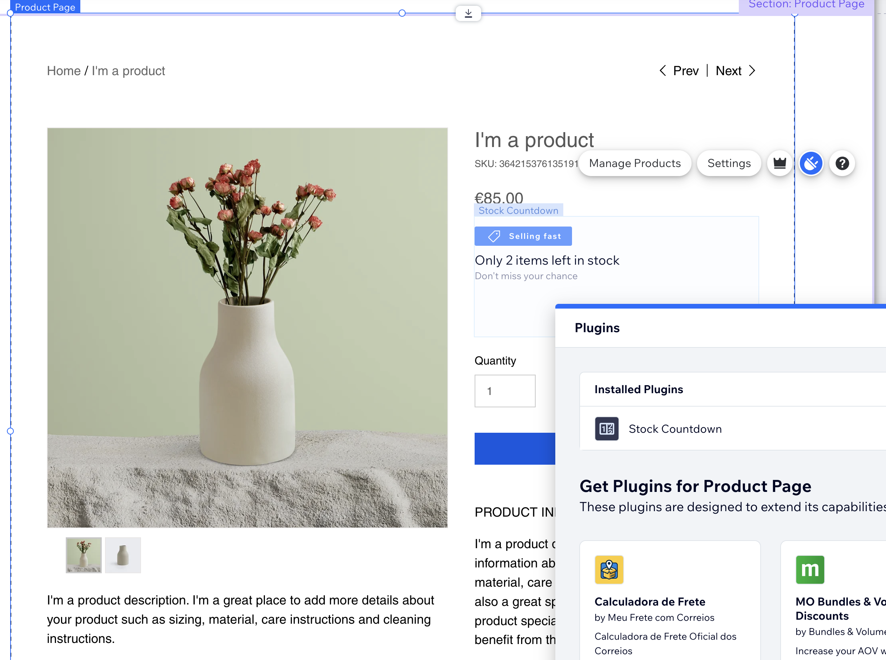

# Wix CLI App Template: Stock Countdown

The Stock Countdown Wix app template is part of the [Wix app template collection](https://dev.wix.com/apps-templates).

This Wix CLI template demonstrates how to build a [site plugin](https://dev.wix.com/docs/build-apps/develop-your-app/frameworks/wix-cli/supported-extensions/site-extensions/site-plugins) for the Wix Stores product page. The Stock Countdown plugin displays the number of remaining items in stock, which it retrieves using the Wix Stores [Invetory API](https://dev.wix.com/docs/sdk/backend-modules/stores/inventory/introduction). 

The template also demonstrates the basic functionality of the Site Window SDK, the React SDK, the Editor SDK, and the Wix Design System.

## About Wix app templates

[Wix apps](https://dev.wix.com/docs/build-apps) enhance the functionality of Wix sites by adding new features such as custom pages, dashboard components, third-party integrations, or site analytics. Starting with an app template fast-tracks the development process, providing a working foundational app that developers can modify and build upon. This approach saves valuable time, allowing for a quick transition from concept to a fully functional app.

Learn more about [Wix app templates](https://dev.wix.com/docs/build-apps/get-started/templates/get-started-from-an-app-template) and explore our growing [template collection](https://dev.wix.com/apps-templates).

## Template features

This Wix app template incorporates the following features:

+ **Wix CLI:** Get a comprehensive developer experience with minimal setup and host your app on Wix with one command. Learn more about the [Wix CLI for apps](https://dev.wix.com/docs/build-apps/developer-tools/cli/get-started/about-the-wix-cli-for-apps).
+ **Wix Design System:** Utilize Wix's reusable React components for a cohesive user experience consistent with Wix's design standards.
+ **Wix Editor SDK**: Integrate panels with the Wix editor.
+ **Wix Site Window SDK**: Contains functionality for working with the browser window.
+ **Wix Stores SDK**: Access and manage data stored on Wix sites. Learn more about the [Wix Stores SDK](https://dev.wix.com/docs/sdk/backend-modules/stores/inventory/introduction).

## Prerequisites

Before getting started, make sure you have the following set up:

+ [Node.js](https://nodejs.org/en/) (v18.16.0 or higher)
+ [A Wix developer account](https://users.wix.com/signin?loginDialogContext=signup&referralInfo=HEADER&postLogin=https:%2F%2Fdev.wix.com%2Fdc3%2Fmy-apps&postSignUp=https:%2F%2Fdev.wix.com%2Fdc3%2Fmy-apps&forceRender=true)

## Local Development

We first need to create local files for our app project and set up a local development environment for preview and testing.

## Step 1 | Create a new app project with the Chart Widget template

In the directory where you want to create your project, run the following command:

```bash
npm create @wix/app@latest -- -t 2ff7a5ae-d116-4c06-9394-7d7493428d0e
```

When asked what you would like to create, choose **A new Wix App**.

In the creation process, you will be asked for:

+ A **Wix app name**. This is the name of your app in the [Wix Dev Center](https://dev.wix.com/apps/my-apps).
+ A site to install and test your app on. You can select an existing site or create a new [development site](https://dev.wix.com/docs/build-apps/develop-your-app/frameworks/wix-cli/get-started/quick-start#development-site).
+ A **package name**. This is the name of the package created locally for your project, and the name of the directory containing your project’s local files.

### What you get

This process registers a new app in the Wix Dev Center and generates a new app project in your local file system. The project contains all the files your app needs to run locally and in production.

The project includes:

+ Initial boilerplate code for a simple app with a site plugin extension.
+ A `package.json` file with your app’s dependencies.

## Step 2 | Test the app

The app creation process installs the app on your chosen development site. However, you won’t see the app extensions on your site until you build the app and create a version. To test the app during development:

1. Set up a local development environment using the following command:

    ```bash
    npm run dev
    ```

    This will prompt you with a CLI menu. 

1. Press **E** to open a browser window with your site editor in your local development environment. 

1. In the editor, navigate to your **Products** page, then find the widget containing the plugin slot as shown in the image below. Learn more about [plugin slots](https://dev.wix.com/docs/build-apps/develop-your-app/extensions/site-extensions/site-plugins/supported-wix-app-pages/about-slots). 

1. Click on the widget and then click on the **plug icon** to open the plugin explorer.

    

1. Find your plugin in the plugin explorer and add it to the slot.

The development environment is set up to automatically reflect your code changes in the browser.

> **Note**: Your plugin will not appear on your site in the local development environment until your publish your site in the editor.

## Extend and customize the app

The template is designed for easy customization and extension. Here are some suggested entry points where you can add your own custom logic or functionality:

### Site plugin panel customization

The site plugin's panel uses the [Wix Design System](https://www.wixdesignsystem.com/) and [Wix Editor SDK](https://dev.wix.com/docs/sdk/host-modules/editor/introduction) to create an interface that allows the user to select a stock threshold below which the counter will be to displayed.

Customize the panel to add more settings or change the appearance.

**Development entry point**: [`template/src/site/plugins/custom-elements/stock-counter/panel.tsx`](template/src/site/widgets/custom-elements/stock-counter/panel.tsx)

### Modify the site plugin's custom element

The site plugin is defined in a `CustomElement` React component. The `plugin.tsx` file serves as the entry point for the custom element component that will be rendered on the user's site. 

Customize the component to add more functionality or change the appearance.

**Development entry point**: [`template/src/site/plugins/custom-elements/stock-counter/plugin.tsx`](template/src/site/plugins/custom-elements/stock-counter/plugin.tsx)

## Deployment

After the app is created you can build it, which allows you to:

+ Create a preview to share with others
+ Create new versions of your app on the Dev Center.

### Build the app

To build the app, run the following command:

```bash
npm run build
```

### Preview the app

You can create an online preview of your built app using the following command:

```bash
npm run preview
```

This command provides an inline link to an app preview URL.

You can share this URL with collaborators on your development site. It directs to a page where they can preview and test your app.

### Create an app version

An app version allows you to publish an app to the Wix App Market or install it on a site with a direct install URL.

To create an app version, run the following command:

```bash
npm run create-version
```

This guides you through creating a new app version in the Wix Developers Center. Once the app version is created, you can optionally [submit it for review](https://devforum.wix.com/kb/en/article/submit-your-app-for-review) and publish it to the [Wix App Market](https://www.wix.com/app-market).

## Learn more

For more information:

+ Learn more about [Wix app templates](https://dev.wix.com/docs/build-apps/get-started/templates/get-started-from-an-app-template).
+ Check out our [full collection of app templates](https://dev.wix.com/apps-templates).
+ See our documentation for details about [building Wix apps](https://dev.wix.com/docs/build-apps).
